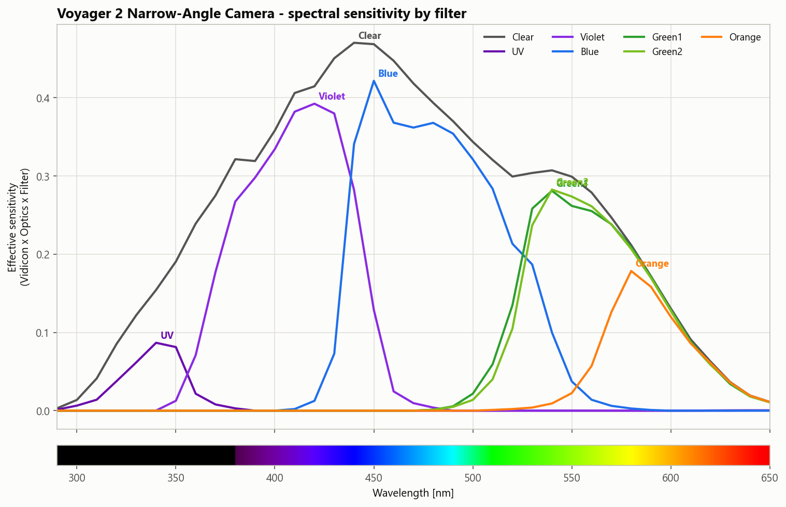
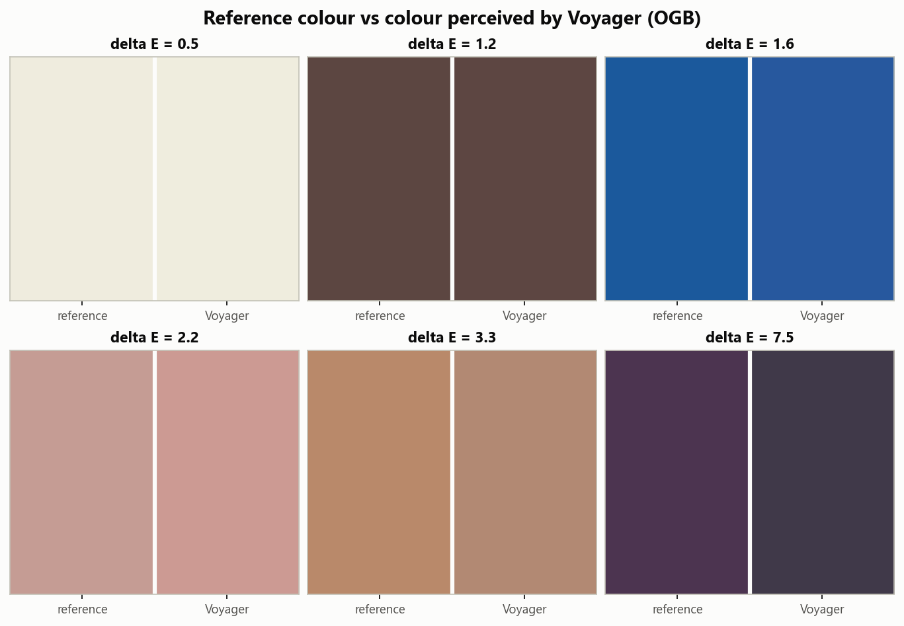
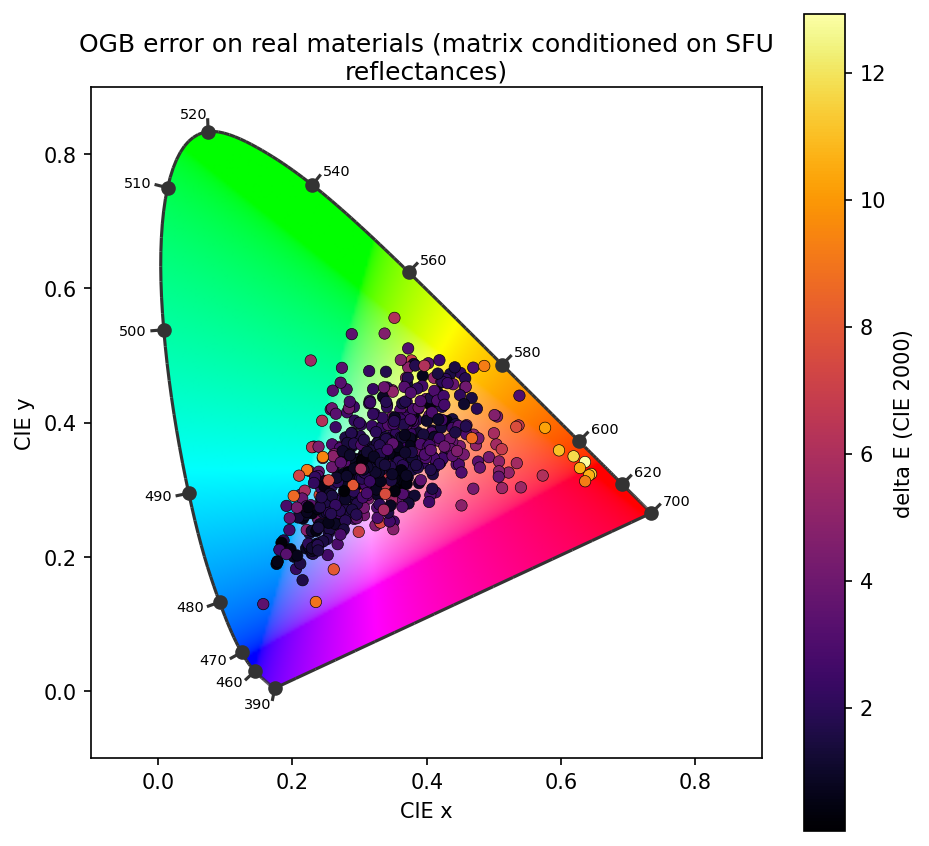

I've always wondered what color the planets really are. It's well known that all our popular science images, the ones that are used to inspire the public and communicate the greatness of our achievements in space, are not in real colors. One of my favorite examples is the brilliant Kevin M. Gill of NASA JPL: https://apoapsys.com/work. What do these images look like without the beauty-enhancing color corrections? 

Secondly, the Voyager spacecraft fascinate me because they're some of earliest probes that we have that took photographs of the outer planets, and they have a surprising amount of quality to them. As with any probe, the data is out there and freely accessible at the [Outer Planets Unified Search](https://opus.pds-rings.seti.org/opus/#).

As one can easily discover on Wikipedia, the Voyager Imaging Science System (ISS) has, depending on the camera, a few different filters with different sensitivities. 

How do we perceive color and how do we make the Voyager images look similar?

Let's look at what happens with the light that lets us see. First, it's emitted by the sun with a wide variety of wavelengths. This has been measured and standardized in many places, for example in ASTM G-173-03. We denote this $I(\lambda)$. In `colour`, we can call it with 

```python
sunlight = colour.plotting.SD_ASTMG173_ETR
```

Next, the light hits the object, with which it interacts in a typically very complicated way. We may parametrize this with our reflectance function $R(\lambda)$, which tells us what fraction of light at a given wavelength is reflected. Finally, the light hits the filter which records it. For us, this is the cones of our eyes, while for Voyager it goes through the optics, filter, and hits the photoconductor of the vidicon camera. We will call this $F(\lambda)$. The thing that we actually perceive, then, is the convolution of all these things:
$$
\text{Perceived colour} = \int d\lambda \, I(\lambda) R(\lambda) F_(\lambda).
$$

The voyager spacecraft has a few different filters. Here's a plot of their sensitivities (including the effect of the vidicon and the optics):



It took many pictures of many things with many different filters. For colour accuracy, we need three pictures of the same thing from the same perspective at the same time (more or less). I found that Voyager most often did this using the filters Orange, Green1, and Blue. Let's take those images, overlay them naïvely, and see what we get:


Since the illuminant and the reflectance are the same, what we need is a way to convert between the way that the Voyager camera perceives light and the way our eyes perceive light. In fact, this kind of color science is already built into digital cameras. They too have their own sensors with different sensitivities to different wavelengths compared to human eyes, so all we need to do is follow the same techniques they do.

What is the space of all colors we can perceive? The 1931 CIE report standardized this; it is the XYZ colour space. Given some incoming light $I(\lambda)$, we perceive three numbers, $X$, $Y$, and $Z$:
$$
X = \int d\lambda \, R(\lambda) \bar{x}(\lambda) \\
Y = \int d\lambda \, R(\lambda) \bar{y}(\lambda) \\
Z = \int d\lambda \, R(\lambda) \bar{z}(\lambda),
$$
where $\bar{x}, \bar{y}, \bar{z}$ are the standardized colour transfer functions fundamental to human vision.

In `colour`,
```python
cmfs = colour.MSDS_CMFS["CIE 1931 2 Degree Standard Observer"]
XYZ = colour.sd_to_XYZ(spectrum, cmfs, sunlight)
```

To first order, let us assume that there exists a matrix $M$ such that
$$
XYZ = M \cdot \text{Voyager}.
$$
It's possible to extend this simple model using higher-order corrections, for example root-polynomial terms [^1] which are naturally invariant to exposure, or neural networks, but we're keeping things simple for now.
Let us denote a set of $N$ known $XYZ$s for a reflectance target as $Q$ and the corresponding camera responses as the $3 \times N$ matrix $R$. Then the least-squares fit is given exactly as the Moore-Penrose (yes, that Penrose!) pseudoinverse:
$$
M=QR^T (RR^T)^{-1}.
$$

But remember, for our Jupiter pictures we don't have the human response! So how can we do this fit? 
The answer is to simulate it using a spectra dataset. A classic in the field is Barnard et. al, "A data set for color research". 
It contains the spectra of "24 Macbeth ColorChecker patches, 1269 Munsell chips, 120 DuPont paint chips, 170 natural objects, the 350 surfaces in the Krinov data set, and 57 additional surfaces measured by [the authors]"[^2].
From these spectra, we can calculate the human-perceived eye colour and what Voyager would perceive, and calculate that least-squares fit. Thanks to the `colour` python package, this is actually pretty easy (but not vectorizable if you use their built-in functions :():

```python
for i in range(1000):
    spectrum = generate_random_spectrum()
    XYZ = colour.sd_to_XYZ(spectrum, cmfs, sunlight)
    OGB = colour.sd_to_XYZ(spectrum, OGB_cmfs, sunlight)

    Q.append(XYZ)
    R.append(OGB)

M = Q @ np.transpose(R) @ np.linalg.inv(R @ np.transpose(R))
```

Fantastic! Let's see what kind of colours we can get out of that. Here are some colour chips that I held out from the training to test on:


Not bad overall. The purple is clearly quite different, but the error in the errors is fairly acceptable given what we're working with. What about on a chromaticity diagram?



Excellent! As expected, given the lack of a pure red filter, a lot of the weakness is concentrated in that area. Rather unfortunate for Jupiter, which is famously... red.


[^1]: G. D. Finlayson, M. Mackiewicz and A. Hurlbert, "Color Correction Using Root-Polynomial Regression," in IEEE Transactions on Image Processing, vol. 24, no. 5, pp. 1460-1470, May 2015, doi: 10.1109/TIP.2015.2405336.

[^2]: Technically speaking, an assumption we're making here is that the chemical compounds that give Jupiter its colour will have similar spectra to the chemical compounds in the dataset. 

