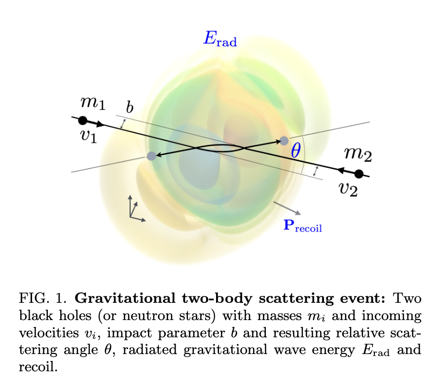

Last year, when we got our [article](https://arxiv.org/abs/2411.11846) accepted by *Nature*, there was an interesting line in the acceptance email that stood out to us: 

> If you have not already done so, you may send potential cover suggestion file(s) to the production department [...]. The file(s) should be sent within a week of receiving this email in order to be considered, and we cannot promise that your cover suggestion will be used, as competition is intense.

Besides being over the moon about the acceptance, we hadn't really expected to be able to submit a cover. It also meant there was a very tight deadline to create this image. Thanks to a suggestion from our editor, we had a starting point in the form of one of our figures, which depicts the scattering event and the associated waveform of the gravitational wave.



This figure was a still from a video created by a bachelor's student and wasn't very high-resolution or accurate [^1].
It's a visualization of a formula that dates back to two pioneers in general relativity, Kovács and Thorne, from their paper [The generation of gravitational waves. IV. Bremsstrahlung.](https://ui.adsabs.harvard.edu/abs/1978ApJ...224...62K/abstract) (see eqs. 3.17-18). 

From general relativity, we know that just like electromagnetic waves have two polarization states, so do gravitational waves. The difference is that electromagnetic waves are typically thought of as vertically or horizontally polarizated, while for gravitational waves are a bit more complicated -- the two states are "cross" and "plus".

Writing it down as one optimized numba function of $x$, $y$, $z$, $t$ (the four spacetime coordinates), $m_1$ and $m_2$ (the masses of both black holes/compact objects), $b$ (the impact parameter), and $\gamma$ (the relative Lorentz factor), it's about 400 lines of python. With some quick python scripting and rough plotting with `matplotlib`, I had some ranges I thought would look good. 

Unfortunately, ParaView doesn't natively support reading in arbitrary numpy arrays. I recommend the VTK format. You can convert it as follows:

```
import numpy as np
import vtk
from tqdm import tqdm
from vtkmodules.util import numpy_support

frames = np.load("waveform_cross.npy")

for i, frame in tqdm(enumerate(frames)):
    image_data = vtk.vtkImageData()
    image_data.SetDimensions(100, 100, 100)
    vtk_array = numpy_support.numpy_to_vtk(num_array=frame.ravel(), deep=True, array_type=vtk.VTK_FLOAT)
    vtk_array.SetName("cross_strain")
    image_data.GetPointData().AddArray(vtk_array)
    image_data.GetPointData().SetScalars(vtk_array)
    writer = vtk.vtkXMLImageDataWriter()
    writer.SetFileName(f"waveform/strain_waveform_plus_{i:03d}.vti")
    writer.SetInputData(image_data)
    writer.Write()
```

Once you've done that, you can import the contents of the `waveform` folder as a series and it'll play back within ParaView as a movie, frame by frame (your computer might have a little trouble doing this quickly). 


After some experimentation with different pieces of software, I settled on ParaView. ParaView is a phenomenal piece of software for visualizing large amounts of scientific data up to the supercomputer scale. It can slices up and transform your data however you want. 

[^1]: To be precise, to use a tool called [`gwpv`](https://nilsvu.de/gwpv/), which also uses ParaView, the waveform had been projected down onto spherical harmonics, but only the first couple had been used, so the figure in the paper was actually mainly just spherical harmonics.